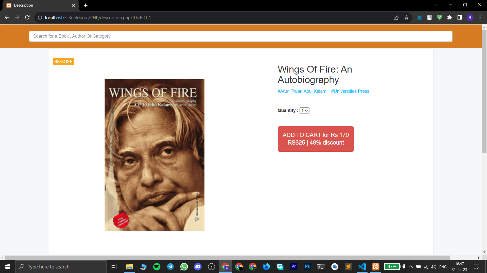

# E-BookStore

#### • E-BookStore is an online book buying webapp. It is developed using PHP.

## Functionalities

- User can register/login.

- User can browse books and add them to cart.

- User can search books using book name, author name, etc.

- User can remove books from the cart.

- User can place order from the cart.

## TechStack

- `HTML` and `PHP` for making the structure of web pages.

- `CSS` and `BootStrap` for styling the web pages.

- `MySQL` Relational Database for storing data like user data, books data, cart data, etc.

- `PHP` for Database interactions and business logic implementation.

## ScreenShot

 

